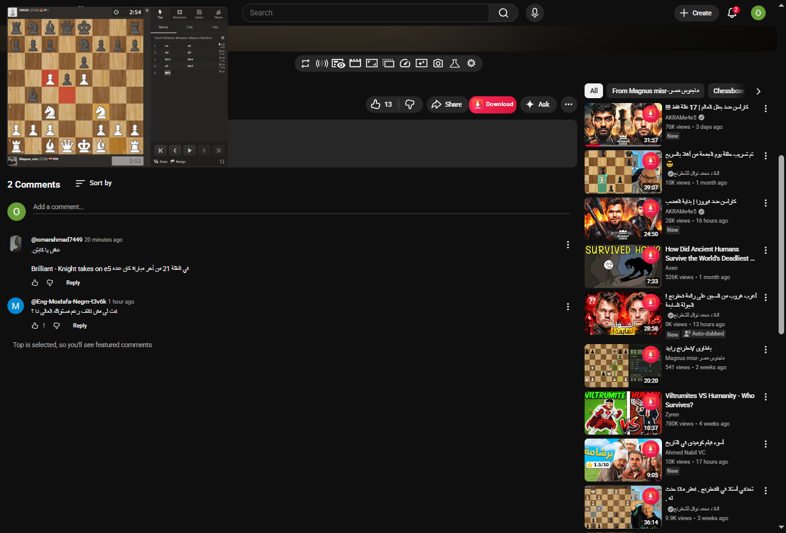

# YouTube Downloader Browser Extension

A browser extension that redirects YouTube videos to the [Y2Mate-style downloader web app](https://github.com/Emam546/youtube-downloader).

## Features

- Redirects YouTube videos to the downloader web app
- Simple and intuitive interface
- Seamless integration with the Y2Mate-style video downloader
- Supports multiple video formats and qualities

## Screenshots

### Main Interface

<!-- Add screenshot here -->

## Installation

1. Download the extension file
2. Load it in your browser's extension manager
3. Navigate to YouTube and start downloading

## Usage

1. Open any YouTube video
2. Click the download button
3. Select your preferred format and quality
4. Wait for the download to complete

## Development

Built with WXT + React.

## Repository

https://github.com/Emam546/youtube-downloader
